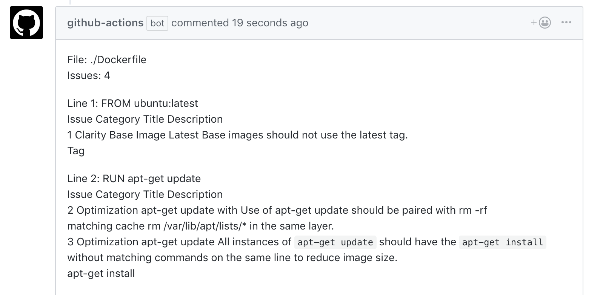

# dockerfile-linter-action
<a href="https://github-actions.netlify.com/docker-linter"></a>  

A GitHub action for linting Dockerfiles and commenting on a PR with any errors.

## Usage

You should have something like this in your `.github/main.workflow`:
```
workflow "on pull request, Dockerfile lint" {
  on = "pull_request"
  resolves = ["Dockerfile lint"]
}

action "Dockerfile lint" {
  uses = "jwr0/dockerfile-linter-action"
  secrets = ["GITHUB_TOKEN"]
  # Optionally, if your Dockerfile is not in the root of your repository,
  # you can specify a DOCKERFILE environment variable with the path to
  # your Dockerfile
  env = {
    DOCKERFILE = "./some/other/directory/Dockerfile"
  }
}
```

As part of a pull request, the GitHub Action bot will comment with any
mistakes it found in your Dockerfile. Or if no mistakes are found, it won't
leave any comment.



## Underlying project

This GitHub Action repository simply packages up other software to make them usable in the context of GitHub Actions. Specifically, the logic used by the Dockerfile linter comes from another project: [replicatedhq/dockerfilelint](https://github.com/replicatedhq/dockerfilelint). They also offer a web-based linter at [fromlatest.io](https://www.fromlatest.io/).

## Issues

Any issues using this GitHub Action can be filed using [GitHub Issues](https://github.com/jwr0/dockerfile-linter-action/issues).
